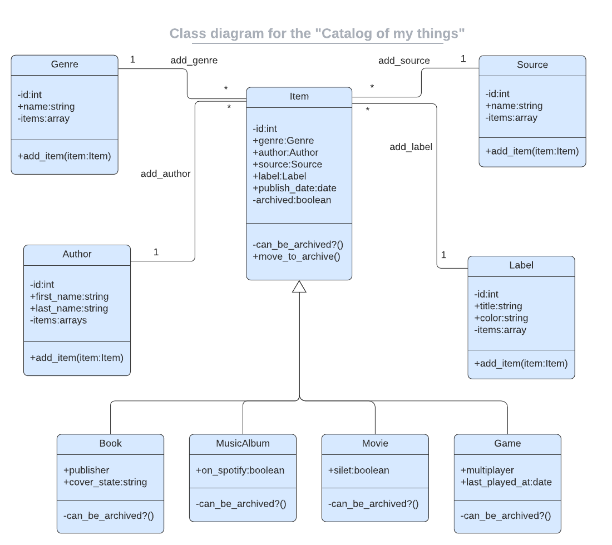

  
   

  <h3><b>Ruby Capstone - Things App</b></h3>

<!-- TABLE OF CONTENTS -->

# 📗 Table of Contents

- [📖 About the Project](#about-project)
  - [🛠 Built With](#built-with)
    - [Tech Stack](#tech-stack)
    - [Key Features](#key-features)
  - [🚀 Live Demo](#live-demo)
- [💻 Getting Started](#getting-started)
  - [Setup](#setup)
  - [Prerequisites](#prerequisites)
  - [Install](#install)
  - [Usage](#usage)
  - [Run tests](#run-tests)
  - [Deployment](#triangular_flag_on_post-deployment)
- [👥 Authors](#authors)
- [🔭 Future Features](#future-features)
- [🤝 Contributing](#contributing)
- [⭐️ Show your support](#support)
- [🙏 Acknowledgements](#acknowledgements)
- [❓ FAQ](#faq)
- [📝 License](#license)

<!-- PROJECT DESCRIPTION -->

# 📖 Catalogue of Things 

> In this project, we created a console app that will help the user to keep a record of different types of things they own: books, music albums, movies, and games. Everything will be based on the UML class diagram presented below. The data will be stored in JSON files.

###UML Class Diagram

## 🛠 Built With 

### Tech Stack 

> This is a console application built with Ruby, PostgreSQL and tested with Rspec

- **Ruby**
- **PostgreSQL**
- **Rspec**

(<a href="#readme-top">back to top</a>)

## Getting Started

To get a local copy up and running follow these simple example steps.

### Prerequisites

Have `Ruby`, and `Git` installed

### Usage

`ruby main.rb`

### Run tests

`rpsec`

(<a href="#readme-top">back to top</a>)

<!-- AUTHORS -->

## 👥 Authors 

👤 **Abdelhadi Hireche**

- GitHub: [@aeh1707](https://github.com/aeh1707)
- Twitter: [@aeh1707](https://twitter.com/aeh1707)
- LinkedIn: [abdelhadi-hireche](https://linkedin.com/in/abdelhadi-hireche)

👤 **Okine Kingsley**

- GitHub: [@killy10o10](https://github.com/killy10o10)
- Twitter: [@Quami_Killy](https://twitter.com/Quami_Killy)
- LinkedIn: [@Kingsley Okine](https://www.linkedin.com/in/kingsley-okine/)

(<a href="#readme-top">back to top</a>)

(<a href="#readme-top">back to top</a>)

<!-- CONTRIBUTING -->

## 🤝 Contributing 

Contributions, issues, and feature requests are welcome!

Feel free to check the [issues page](../../issues/).

(<a href="#readme-top">back to top</a>)

<!-- SUPPORT -->

## ⭐️ Show your support 

> If you like this project give it a star ⭐

(<a href="#readme-top">back to top</a>)

<!-- ACKNOWLEDGEMENTS -->

## 🙏 Acknowledgments 

> I would like to thank Microverse Community.

(<a href="#readme-top">back to top</a>)

<!-- LICENSE -->

## 📝 License 

This project is [MIT](./MIT.md) licensed.

(<a href="#readme-top">back to top</a>)

